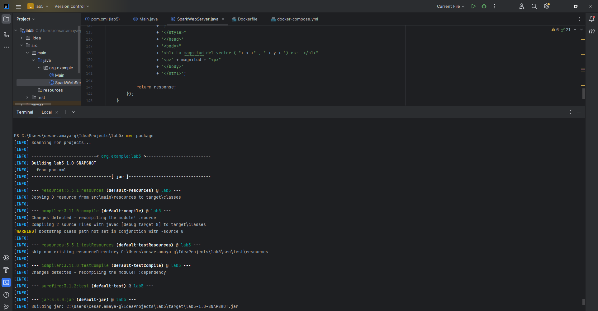
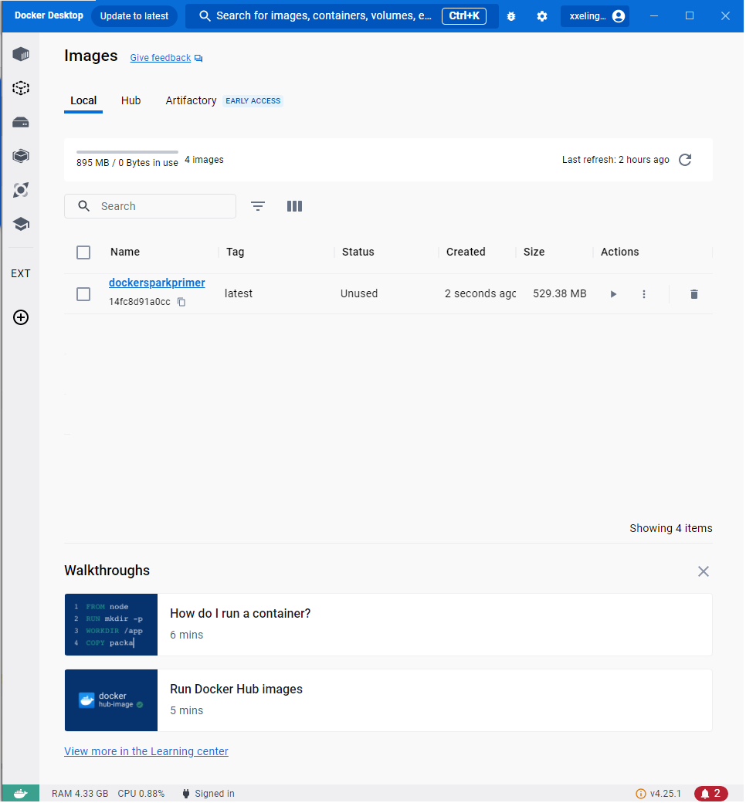

# TALLER 5 MODULARIZACIÓN CON VIRTUALIZACIÓN E INTRODUCCIÓN A DOCKER

Este proyecto consiste en desarrollar una pequeña aplicación web utilizando el micro-framework Spark Java. La aplicación ofrece una interfaz simple que permite calcular funciones trigonométricas (seno y coseno) y verificar si una cadena es un palíndromo. También permite calcular la magnitud de un vector real bidimensional.

## PARA EMPEZAR

Se debe contar con un Sistema Operativo capaz de correr un IDE para poder realizar la ejecución el aplicativo, pues este cuenta con los siguientes componentes:
* [Java version 8](https://www.oracle.com/co/java/technologies/downloads/) - Lenguaje de programación usado. (tiene que ser 8 para usar funciones lambda)
* [Maven](https://maven.apache.org/download.cgi) - Gestor de dependencias del proyecto
* [Git](https://git-scm.com/downloads) - Gestion de versiones del proyecto 
* [Docker](https://www.docker.com/products/docker-desktop/) - Gestion de contenedores con  aplicaciones sus dependencias


## ARQUITECTURA
La arquitectura del taller consiste en tres componentes principales:

* Aplicación Web (Spark Java): 
Se crea una aplicación web pequeña utilizando el micro-framework de Spark Java. La aplicación será responsable de mostrar información básica y de manejar algunas funcionalidades interactivas. Se configura para que escuche en un puerto específico y tenga rutas que respondan a solicitudes HTTP, como "GET /hello" que devuelve "Hello Docker!".
* Docker: 
Se crea un contenedor de Docker para la aplicación web. Un Dockerfile se utiliza para definir el entorno de ejecución de la aplicación y cualquier dependencia necesaria. La aplicación y sus dependencias se empaquetan en una imagen de contenedor que se puede ejecutar en cualquier entorno compatible con Docker.

 la arquitectura del taller consiste en una aplicación web desarrollada en Spark Java, empaquetada como un contenedor de Docker. Esto permite que la aplicación sea escalable, portátil y fácil de gestionar en cualquier entorno.

 ## DISEÑO DE LA CLASE

### Clase SparkWebServer
 Esta clase es la clase principal de la aplicación y se encarga de configurar y ejecutar el servidor web utilizando Spark Java. Contiene los siguientes elementos:

* Atributos:
- port: Un atributo entero que indica el puerto en el que se ejecutará el servidor. Por defecto, el valor es 4567.
* Métodos:
- main(String... args): El método principal que inicia el servidor web. Configura el puerto del servidor y define las rutas para los diferentes endpoints de la API.
- getPort(): Un método privado que determina el puerto en el que se ejecutará el servidor. Si existe una variable de entorno PORT, utiliza ese valor como puerto, de lo contrario, utiliza el valor por defecto.
* Endpoints de la API: La clase define varios endpoints de la API que proporcionan diferentes funcionalidades. Cada endpoint tiene una URL específica y una lógica asociada para manejar las solicitudes. Los endpoints incluyen:

- GET /hello: Un endpoint simple que devuelve un saludo.
- GET /calcular/sin: Un endpoint que calcula el seno de un ángulo dado.
- GET /calcular/cos: Un endpoint que calcula el coseno de un ángulo dado.
- GET /palindromo: Un endpoint que determina si una cadena es un palíndromo.
- GET /calcular/magnitud: Un endpoint que calcula la magnitud de un vector de dos dimensiones.

* Respuestas HTML: Para cada endpoint, la clase genera una respuesta HTML que se envía al cliente. Las respuestas incluyen un título y un mensaje con el resultado del cálculo.

Este diseño de clases es una representación básica de la funcionalidad de la aplicación y puede ser extendido o modificado según sea necesario.


## INICIANDO EL PROYECTO

escriba la siguiente linea en la consola para clonar el repositorio donde se encuentra el codigo del taller

```bash
git clone https://https://github.com/XxELIngexX/lab5.git
```

liego escriba este comando para limpiar el proyecto Maven y compilarlo, si lo hace desde consola cdm es importante que este ubicado en el directorio lab5, o puede ejecutarlo desde el terminal en el IDLE

```bash
mvn clean install
```


listo, ya quedo el tema del codigo, ahora veamos como crear el contenedor.
1. abra docker para que pueda crear un contenedor sin problema
2. vuelva a la consola y ejecute el siguiente comando
```bash
docker build --tag dockersparkprimer .
```
En resumen, este comando construye una imagen de Docker a partir de un Dockerfile y otros archivos necesarios para la construcción (todo esto ya se encuentra en el proyecto que clono), y luego le asigna el nombre dockersparkprimer a la imagen resultante.



es importante que en la consola ejecute el comando
```bash
mvn package
```
este comando compilara todo el proyecto

### listo para ejecutar
ya esta todo listo, para poder ejecutar el proyecto ingrese por consola el siguiente comando:
```bash
java -cp "target/classes;target/dependency/*" org.example.SparkWebServer

```


### DESCRIPCION DEL PROYECTO

acceda al servicio por medio de la siguiente URL:

´
http://localhost:4567/hello
´

se vera el siguiente front retornado por el servidor:

# imagen 3


## DESARROLLADO CON

* [Java version 17](https://www.oracle.com/co/java/technologies/downloads/) - Lenguaje de programación usado.
* [Maven](https://maven.apache.org/download.cgi) - Gestor de dependencias del proyecto
* [Git](https://git-scm.com/downloads) - Gestion de versiones del proyecto
* [Docker](https://www.docker.com/products/docker-desktop/) - Gestion de contenedores con  aplicaciones sus dependencias

<!--
## Version

We use [SemVer](http://semver.org/) for versioning. For the versions available, see the [tags on this repository](https://github.com/your/project/tags). -->

## Autor

* **Cesar Amaya Gomez** - [XxELIngexX](https://github.com/XxELIngexX)

<!--
## License
This project is licensed under the MIT License - see the [LICENSE.md](LICENSE.md) file for details -->

## Agradecimientos

* Especial Agradecimiento al profesor [Luis Daniel Benavides Navarro](https://ldbn.is.escuelaing.edu.co/) por brindar el conocimiento necesario en la realización de este trabajo
